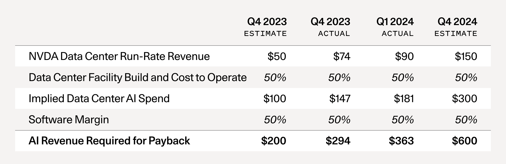
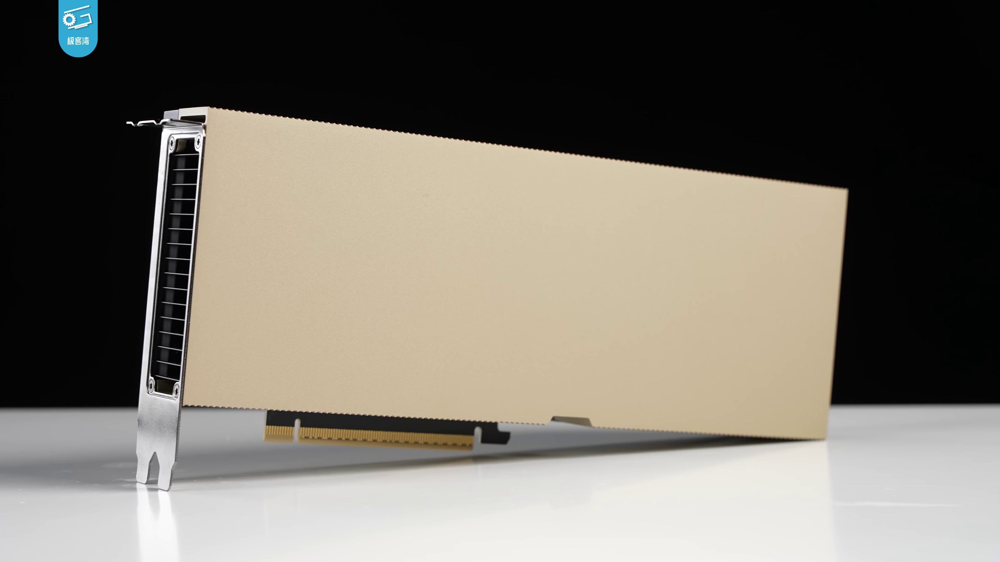
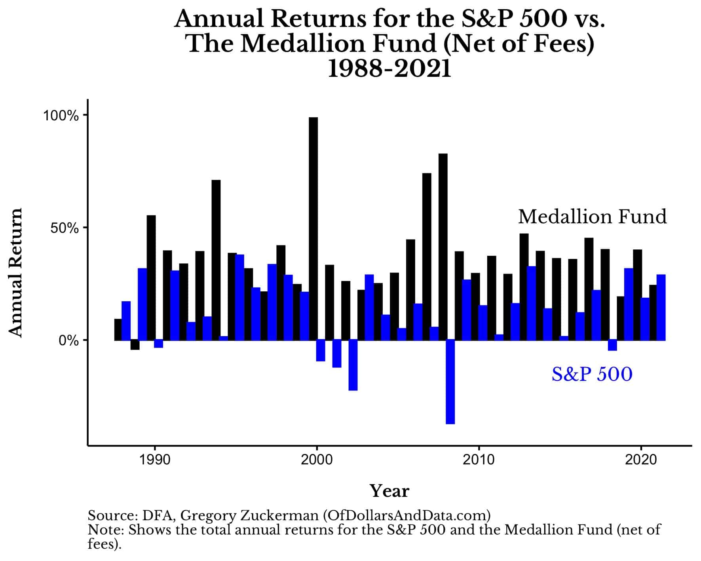

```{r setup, include=FALSE}
options(htmltools.dir.version = FALSE)
library(knitr)
opts_chunk$set(
  prompt = T,
  fig.align="center",
  dpi=300,
  cache=T,
  engine.opts = list(bash = "-l")
  )

knit_hooks$set(
  prompt = function(before, options, envir) {
    options(
      prompt = if (options$engine %in% c('sh','bash', 'zsh')) '$ ' else 'R> ',
      continue = if (options$engine %in% c('sh','bash', 'zsh')) '$ ' else '+ '
      )
})

options(repos = c(CRAN = "https://cran.rstudio.com/"))

if (!require("fontawesome", character.only = TRUE)) {
  install.packages("fontawesome", dependencies = TRUE)
  library(fontawesome, character.only = TRUE)
}
```

## Nice to meet you!
### A bit about me

:::: {.columns}
::: {.column}
[{width="200"}](#){data-modal-type="image" data-modal-url="figures/profile.jpg"}

::: {style="font-size: 26px;"}
`r fa('envelope')` [danilo.freire@emory.edu](mailto:danilo.freire@emory.edu)

`r fa('globe')` <https://danilofreire.github.io/>

`r fa('github')` <https://github.com/danilofreire/>
:::
:::

:::{.column}
:::{style="font-size: 23px;"}
`r fa('chalkboard-user')` Visiting Assistant Professor in the [Department of Data and Decision Sciences](https://quantitative.emory.edu)

`r fa('graduation-cap')` MA from the Graduate Institute Geneva, PhD from King's College London, Postdoc at Brown University, Senior Lecturer at the University of Lincoln, UK

`r fa('book-open')` Research interests: computational social science, experimental methods, policy evaluation

`r fa('robot')` I teach [DATASCI 185: Introduction to AI Applications](https://danilofreire.github.io/datasci185), [DATASCI 350 - Data Science Computing](https://danilofreire.github.io/datasci350), and [DATASCI 385 - Experimental Methods](https://danilofreire.github.io/datasci385)
:::
:::
::::

# Some thoughts on AI startups {background-color="#2d4563"}

## The $600 billion question
### One frame to hold onto tonight

:::{style="font-size: 26px; margin-top: 40px;"}
::: {.columns}
::: {.column width="45%"}
- Sequoia's David Cahn, 2024: [AI's $600B Question](https://sequoiacap.com/article/ais-600b-question/)
- The hardware build-out implies [$600B]{.alert} in yearly revenue
- Actual AI revenue is a tiny fraction of that
- The frame for tonight: [where's the cash coming from?]{.alert}
- Ask this about every startup I mention
:::

::: {.column width="55%"}
[{width="100%"}](#){data-modal-type="image" data-modal-url="figures/sequoia-600b.png"}

::: {style="font-size: 14px; color: #666;"}
The gap between AI capex and AI revenue. Source: David Cahn, [Sequoia Capital (2024)](https://sequoiacap.com/article/ais-600b-question/)
:::
:::
:::
:::

## Where the money is going
### Record volumes, extreme concentration

:::{style="font-size: 26px; margin-top: 40px;"}
:::{.columns}
:::{.column width="55%"}
- February 2026: [$189B](https://news.crunchbase.com/venture/record-setting-global-funding-february-2026-openai-anthropic/) in venture funding, an all-time record
- [83%](https://techcrunch.com/2026/03/03/openai-anthropic-waymo-dominated-189-billion-vc-investments-february-crunchbase-report/) went to three firms:
  - [OpenAI]{.alert} ($110B)
  - [Anthropic]{.alert} ($30B)
  - [Waymo]{.alert} ($16B)
- 2024 corporate AI: [$252B](https://hai.stanford.edu/ai-index/2025-ai-index-report/economy) (Stanford AI Index)
- US: [$109B](https://hai.stanford.edu/ai-index/2025-ai-index-report/economy). China: $9.3B. UK: $4.5B
- If you are not one of those three, [your fundraising looks nothing like this]{.alert}
:::

::: {.column width="45%"}
:::{style="margin-top: -30px;"}
[{width="100%"}](#){data-modal-type="image" data-modal-url="figures/sam-altman.jpg"}

::: {style="font-size: 14px; color: #666;"}
Sam Altman, CEO of OpenAI, whose single $110B raise accounted for over half of February 2026's record month. Photo: TED / [Wikimedia Commons](https://commons.wikimedia.org/wiki/File:Sam_Altman_speaking_at_TED_(cropped).jpg) (CC BY 4.0)
:::
:::
:::
:::
:::

## The three layers of AI
### Different layers, wildly different economics

:::{style="font-size: 30px; margin-top: 40px;"}
- [Models]{.alert}: OpenAI, Anthropic, Google, xAI, Meta, DeepSeek, Kimi, Z.ai
  - Capital-heavy, very few winners, most still losing money
- [Infrastructure]{.alert}: NVIDIA, the cloud, vector DBs, evaluation tools
  - Quiet, profitable, picks-and-shovels
- [Applications]{.alert}: vertical tools on top. Cursor, Windsurf, Harvey, Perplexity
  - Low cost to start, brutal competition, thin moats
- So far, [most of the value has gone to layers 1 and 2]{.alert}
- Most startups live at layer 3, and [most die there]{.alert}
- Good primer: Sequoia's [AI in 2025](https://sequoiacap.com/article/ai-in-2025/)
:::

## The wrapper problem
### Why "we use GPT-4" is not a business

:::{style="font-size: 26px; margin-top: 40px;"}
:::: {.columns}
::: {.column width="55%"}
- A "wrapper" calls someone else's model with a nice interface
- My acid test: [if OpenAI shut down its API tomorrow, would the company still exist?]{.alert}
- Three structural problems:
  - Every call [costs money]{.alert}, so margins are thin
  - The underlying model gets cheaper and better every quarter
  - If the idea is obvious, 50 other teams are already building it
- Wrappers can make money. They rarely become real companies
:::

::: {.column width="45%"}
[{width="100%"}](#){data-modal-type="image" data-modal-url="figures/nvidia-h100.png"}

::: {style="font-size: 14px; color: #666;"}
NVIDIA H100, the chip your API calls are running on. Photo: Geekerwan / [Wikimedia Commons](https://commons.wikimedia.org/wiki/File:NVIDIA_H100_(%E6%9E%81%E5%AE%A2%E6%B9%BEGeekerwan)_001.png) (CC BY 4.0)
:::
:::
::::
:::

## Inside Y Combinator
### What the top accelerator tells us about the AI wave

:::{style="font-size: 26px; margin-top: 40px;"}
:::: {.columns}
::: {.column width="55%"}
- YC has funded [5,000+ startups](https://en.wikipedia.org/wiki/Y_Combinator) and 82 unicorns
- Winter 2024: [around half](https://news.crunchbase.com/venture/yc-winter-batch-2024-ai-startup-seed-funding/) were building with AI (per Garry Tan)
- Summer 2025: [88 percent](https://www.extruct.ai/research/ycs25/) were AI-native
- Recent batches are the [fastest-growing in YC history](https://www.cnbc.com/2025/03/15/y-combinator-startups-are-fastest-growing-in-fund-history-because-of-ai.html)
- But notice: Cursor, Harvey, Perplexity [did not go through YC]{.alert}
- [Lesson]{.alert}: the biggest winners already had the network
:::

::: {.column width="45%"}
:::{style="margin-top: -30px; text-align: center;"}
[{width="60%"}](#){data-modal-type="image" data-modal-url="figures/garry-tan.jpg"}

::: {style="font-size: 14px; color: #666;"}
Garry Tan, CEO of Y Combinator. Photo: Web Summit / [Wikimedia Commons](https://commons.wikimedia.org/wiki/File:Garry_Tan,_Web_Summit_2018,_November_6_SD5_6949_(45700698642)(portrait_4x3_crop).jpg) (CC BY 2.0)
:::
:::
:::
::::
:::

## What investors actually want
### Four questions to ask about any AI company

:::{style="font-size: 30px; margin-top: 40px;"}
1. [Proprietary data]{.alert}. Does using the product produce data that improves it?
2. [Workflow lock-in]{.alert}. Once a customer is using it, how painful is switching?
3. [Distribution]{.alert}. Who already has the customers? Sales, partners, brand, virality?
4. [Unit economics]{.alert}. Does each customer earn more than they cost in compute?

If a founder cannot answer all four clearly, [that is your answer]{.alert}
:::

## Case study: winners
### Three companies doing it right (so far)

:::{style="font-size: 22px; margin-top: 30px;"}
:::: {.columns}
::: {.column width="33%"}
[Cursor (Anysphere)]{.alert}
*code editor*

- [$1B ARR in under 24 months](https://www.saastr.com/cursor-hit-1b-arr-in-17-months-the-fastest-b2b-to-scale-ever-and-its-not-even-close/)
- [$29.3B valuation](https://www.cnbc.com/2025/11/13/cursor-ai-startup-funding-round-valuation.html) (Nov 2025)
- MIT founders, seeded by OpenAI Startup Fund
- Owns the developer workflow
:::

::: {.column width="33%"}
[Harvey]{.alert}
*legal AI*

- [$11B valuation](https://www.cnbc.com/2026/03/25/legal-ai-startup-harvey-raises-200-million-at-11-billion-valuation.html) (Mar 2026)
- [100,000+ lawyers](https://techcrunch.com/2026/03/25/harvey-confirms-11b-valuation-sequoia-triples-down/) across 1,300 firms
- First [OpenAI Startup Fund](https://openai.com/index/harvey/) investment
- Deep integration, trained on firm data
:::

::: {.column width="33%"}
[Perplexity]{.alert}
*AI search*

- [$20B valuation](https://techcrunch.com/2025/09/10/perplexity-reportedly-raised-200m-at-20b-valuation/) (Sep 2025)
- 40x in 18 months from $500M
- ~22M monthly users, ~$200M ARR
- The free tier is the moat
:::
::::

The pattern: [pick a domain, own the workflow, compound the data]{.alert}
:::

## Case study: losers
### Brilliant teams, real tech, no business

:::{style="font-size: 24px; margin-top: 30px;"}
- [Inflection AI]{.alert} (chatbot "Pi")
  - Raised [~$1.5B](https://techcrunch.com/2024/03/21/microsoft-inflection-ai-investors-reid-hoffman-bill-gates/), burnt through most of it
  - Microsoft paid [$650M](https://www.bloomberg.com/news/articles/2024-03-21/microsoft-to-pay-inflection-ai-650-million-after-scooping-up-most-of-staff) to license the tech, hired the 70-person team
  - Lesson: [a model alone is not a business]{.alert}
- [Adept]{.alert} (AI agents)
  - Raised [~$415M](https://techcrunch.com/2024/06/28/amazon-hires-founders-away-from-ai-startup-adept/), Amazon hired the founders in June 2024
  - Lesson: [if your moat is talent, you can be hired away]{.alert}
- [Humane AI Pin]{.alert} (wearable device)
  - Raised [$230M](https://techcrunch.com/2025/02/18/humanes-ai-pin-is-dead-as-hp-buys-startups-assets-for-116m/), sold to HP for $116M in Feb 2025
  - Lesson: [novel form factors rarely beat existing distribution]{.alert}
:::

## A 10-minute startup evaluation
### Questions to ask, in order

:::{style="font-size: 28px; margin-top: 40px;"}
1. Google the founders. Are they domain experts, or random pivoters?
2. [What data do they have that nobody else does?]{.alert}
3. [What happens to their margins when GPT-5 is half the price?]{.alert}
4. Ask for a live demo. Break it with your own input
5. Look at [who the customers are]{.alert}, not how many
6. Search Product Hunt. 30 clones means they are not special
7. [Who would buy the company if the founders quit tomorrow?]{.alert}
:::

## Red flags in a pitch
### What to listen for when a founder speaks

:::{style="font-size: 26px; margin-top: 40px;"}
:::: {.columns}
::: {.column width="55%"}
- "We use Claude" with no plan beyond that
- Vague answers about [where the data comes from]{.alert}
- No discussion of unit economics
- Demo-driven, no real customers
- They talk about the model more than the customer
- [Paul Graham, 2025](https://www.cnbc.com/2025/08/18/yc-co-founder-paul-graham-not-every-new-company-needs-to-be-about-ai): "Not every new company needs to be about AI"
- Founders matter more than the idea
:::

::: {.column width="45%"}
:::{style="margin-top: -30px; text-align: center;"}
[{width="70%"}](#){data-modal-type="image" data-modal-url="figures/paul-graham.jpg"}

::: {style="font-size: 14px; color: #666;"}
Paul Graham, co-founder of Y Combinator. Photo: [Wikimedia Commons](https://commons.wikimedia.org/wiki/File:Paulgraham_240x320.jpg) (CC BY-SA 2.5)
:::
:::
:::
::::
:::

# AI and the markets {background-color="#2d4563"}

## A tour of the quant world
### The firms actually using AI for trading

:::{style="font-size: 26px; margin-top: 40px;"}
:::: {.columns}
::: {.column width="55%"}
- [Renaissance Technologies]{.alert}. Medallion Fund: [66% per year, 1988-2018, before fees](https://www.institutionalinvestor.com/article/2bswymr8cih3jeaslxc00/portfolio/famed-medallion-fund-stretches-explanation-to-the-limit-professor-claims). Closed since 1993
- [Two Sigma]{.alert}. Around [$70 billion AUM](https://en.wikipedia.org/wiki/Two_Sigma). ML on alt data
- [Citadel Securities]{.alert}. Thousands of trades per second
- [D.E. Shaw, Jane Street, Hudson River, AQR]{.alert}
- Quant managers [drove record AUM growth](https://www.ib.barclays/our-insights/3-point-perspective/hedge-fund-outlook-2026.html) in 2025 (Barclays)
:::

::: {.column width="45%"}
:::{style="margin-top: -30px; text-align: center;"}
[{width="100%"}](#){data-modal-type="image" data-modal-url="figures/nyse-floor.jpg"}

::: {style="font-size: 14px; color: #666;"}
NYSE trading floor. Photo: Kevin Hutchinson / [Wikimedia Commons](https://commons.wikimedia.org/wiki/File:NYSE_Advanced_Trading_Floor.jpg) (CC BY 2.0)
:::
:::
:::
::::
:::

## What LLMs are actually used for in finance
### Mostly not for picking stocks

:::{style="font-size: 28px; margin-top: 40px;"}
- [Sentiment analysis]{.alert}: news, earnings calls, analyst reports, X, Reddit
- [Document processing]{.alert}: summarising 10-Ks, extracting data from filings
- [Alternative data parsing]{.alert}: unstructured text → trade signals
- [Compliance and risk]{.alert}: flagging suspicious trades, monitoring communications
- Pictet AM says [up to 50% of alpha](https://am.pictet.com/us/en/investment-views/active-equity/2025/how-ai-is-laying-the-foundations-for-quant-2-0) in their AI strategies comes from ML "conditioning" of existing factors
- Survey: [From Deep Learning to LLMs in Quant Investment](https://arxiv.org/html/2503.21422v1)
:::

## The alpha decay problem
### Why no AI strategy stays ahead for long

:::{style="font-size: 30px; margin-top: 40px;"}
- An [alpha]{.alert} is an edge that earns returns above the market
- Once discovered and widely traded, [it disappears]{.alert}
- Every serious quant fund is in a [permanent arms race]{.alert}
- LLMs are now used to generate candidate factors automatically
- The truth to carry with you: [there is no permanent edge in markets]{.alert}
- Today's miracle is tomorrow's consensus, and the day after that it is in an ETF
:::

## So why does Renaissance still win?
### What thirty years of returns can teach us

:::{style="font-size: 24px; margin-top: 30px;"}
:::: {.columns}
::: {.column width="55%"}
- Medallion reportedly returned [~30% in 2024](https://www.institutionalinvestor.com/article/2e0uykr3vn5booz0smrcw/hedge-funds/renaissances-2024-rebirth), when many AI-heavy funds struggled
- Three reasons it keeps working:
  1. [Closed to new money since 1993]{.alert}, so it stays small
  2. [Extreme secrecy]{.alert}, so strategies do not leak
  3. [No AI hype]{.alert}: physicists and statisticians, not ML influencers
- Beating the market is extremely hard, but possible. It just looks like forty years of quiet, boring work 😅
:::

::: {.column width="45%"}
[{width="100%"}](#){data-modal-type="image" data-modal-url="figures/medallion-returns.jpeg"}

::: {style="font-size: 14px; color: #666;"}
Medallion Fund annual returns vs S&P 500, 1988-2021. Chart: [Of Dollars And Data](https://ofdollarsanddata.com/medallion-fund/). Data: Bradford Cornell
:::
:::
::::
:::

## Retail AI tools for investing
### What you have, what it can't do

:::{style="font-size: 26px; margin-top: 40px;"}
- [eToro global survey](https://www.etoro.com/news-and-analysis/etoro-updates/retail-investors-flock-to-ai-tools-with-usage-up-46-in-one-year/): 19% of retail investors used AI in 2025, up from 13%
- Common tools: ChatGPT, Claude, Perplexity Finance, Gemini, Magnifi, Composer
- What ChatGPT cannot do well for stock picks:
  - [No real-time data]{.alert} unless you connect a tool
  - [Hallucinates]{.alert} on smaller companies
  - [Trained to please you]{.alert}, not to disagree
  - Fitted to recent history, bad in downturns
- [StockBench (2025)](https://arxiv.org/abs/2510.02209): most LLM agents [failed to beat buy-and-hold]{.alert}
:::

## Your AI investing checklist
### Before you trust any AI finance tool with real money

:::{style="font-size: 28px; margin-top: 40px;"}
1. Does it pull [live data]{.alert} or use a stale training cut-off?
2. Does it cite [sources you can check]{.alert}?
3. Ask it to [argue the opposite side]{.alert} of a company you like
4. Test it on a [small company you know well]{.alert}. Watch for hallucinations
5. Ask for [confidence intervals]{.alert}. A good tool admits uncertainty
6. [Write down your own reasoning]{.alert} before acting on its answer
7. [Never give an AI tool access to your brokerage account]{.alert}
:::

## My personal veredict
### What AI can and cannot do for an individual investor

:::{style="font-size: 26px; margin-top: 30px;"}
:::: {.columns}
::: {.column}
[Can do well]{.alert}

- Read filings and summarise earnings calls
- Compare companies on fundamentals
- Scan news for sentiment shifts
- Draft research notes
- Catch arithmetic mistakes
- Explain jargon in plain English
:::

::: {.column}
[Cannot do well]{.alert}

- Predict prices reliably
- Replace your judgement
- Beat a low-cost index fund long term
- Tell you when it is wrong
- Know what happened yesterday
:::
::::

A useful mental model: [AI is a research analyst who is fast, tireless, slightly drunk, and occasionally lying]{.alert}
:::

## Three takeaways
### The whole talk compressed into three sentences

:::{style="font-size: 30px; margin-top: 40px;"}
1. [AI startups]{.alert}: ignore the model, look at the moat. Ask about data, workflow, distribution, and unit economics. If any is missing, [walk away]{.alert}
2. [AI in markets]{.alert}: it works, mostly as a research layer. The firms that actually beat the market are small, secretive, and decades in. [Your ChatGPT is not one of them]{.alert}
3. [For you]{.alert}: the cheap, obvious applications are saturated. Real opportunities are where [you personally]{.alert} have data, distribution, or domain knowledge nobody else has
:::

# Thank you! 🙏🏻 {background-color="#2d4563"}

## Questions and further reading

:::: {.columns}
::: {.column}
::: {style="font-size: 26px;"}
`r fa('envelope')` [danilo.freire@emory.edu](mailto:danilo.freire@emory.edu)

`r fa('globe')` <https://danilofreire.github.io/>

`r fa('github')` <https://github.com/danilofreire/>
:::

::: {style="font-size: 20px;"}
To start the discussion:

- Which AI startup has the most defensible moat? Why?
- $10,000 in one AI company: which, and what's the exit?
:::
:::

::: {.column}
::: {style="font-size: 17px;"}
[Further reading]{.alert}

- Sequoia, [AI's $600B Question](https://sequoiacap.com/article/ais-600b-question/) (2024)
- Sequoia, [AI in 2025](https://sequoiacap.com/article/ai-in-2025/)
- Stanford HAI, [AI Index 2025](https://hai.stanford.edu/ai-index/2025-ai-index-report)
- Crunchbase, [record Feb 2026 funding](https://news.crunchbase.com/venture/record-setting-global-funding-february-2026-openai-anthropic/)
- Paul Graham, [Essays](https://paulgraham.com/articles.html)
- a16z, [Top 100 GenAI Consumer Apps](https://a16z.com/100-gen-ai-apps-6/)
- arXiv, [From Deep Learning to LLMs in Quant Investment](https://arxiv.org/html/2503.21422v1)
- arXiv, [StockBench (2025)](https://arxiv.org/abs/2510.02209)
- Gregory Zuckerman, *The Man Who Solved the Market*
- Pictet AM, [Quant 2.0](https://am.pictet.com/us/en/investment-views/active-equity/2025/how-ai-is-laying-the-foundations-for-quant-2-0)
- eToro, [retail investors and AI](https://www.etoro.com/news-and-analysis/etoro-updates/retail-investors-flock-to-ai-tools-with-usage-up-46-in-one-year/)
:::
:::
::::
